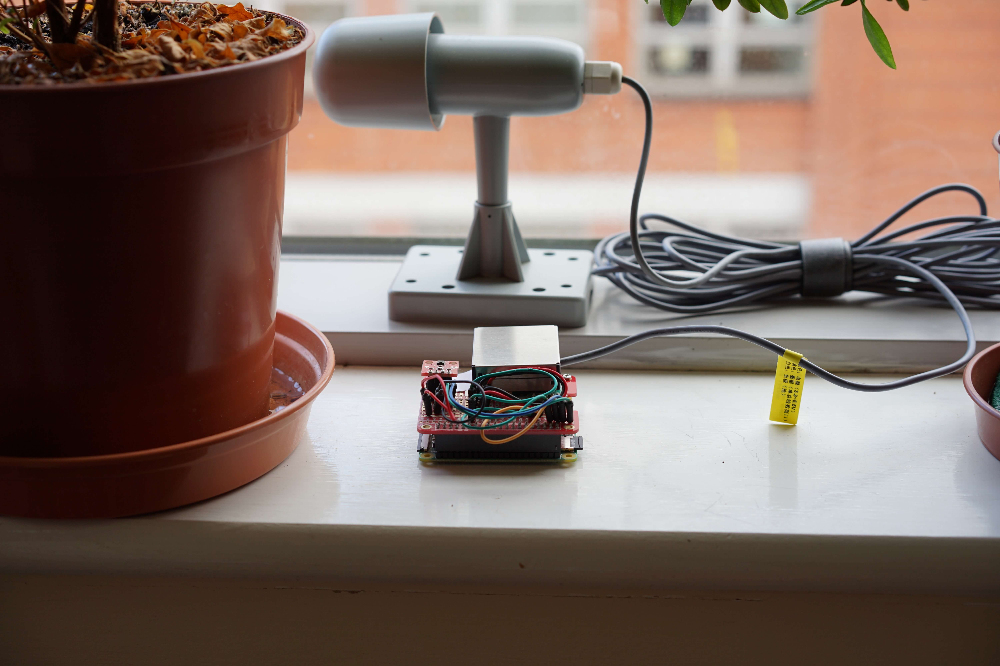

# Raspberry Pi Environmental Sensing

This project is a personal sensing station that uses Raspberry Pi, HTU21D (indoor temperature/humidity), AM2306 (outdoor temperature/humidity) and PMS7003 (particle matter level). It supports logging measured sensory data locally and submit to a MQTT broker and/or a MySQL database.

- Raspberry Pi is a popular open-source hardware. This program is tested on RPi Zero W, but should support all versions of RPi.
- HTU21D is a high precision temperature + humidity sensor and it is connected to RPi via I2C_1.
- AM2306 is an outdoor temperature + humidity sensor, which uses the DHT22 chip. It is connected to RPi via Pin 7.
- PMS7003 is a laser particle matter sensor. It connects to the RPi using the serial port.
- MQTT is a subscribe/publish message protocol designed for light-weight IoT devices.
- MySQL is a relational SQL database.

## 1. Requirements

- Python >= 3.5
- To use AM2306/DHT22:
  - Install RPi.GPIO: `sudo apt-get install python-rpi.gpio`
  - Install the Adafruit driver: https://github.com/adafruit/Adafruit_Python_DHT
- To report to a MQTT broker: https://pypi.org/project/paho-mqtt/
- To report to a MySQL server: `sudo apt-get install python3-pymysql`

## 2. Usage

1. Change to home directory: `cd ~`
2. Clone the project: `git clone https://github.com/automaticdai/rpi-environmental-sensing`
3. Edit the configuration file `rpi-weather-config.json` and save
4. Copy the configuration file to /etc: `sudo cp rpi-weather-config.json /etc/rpi-weather-config.json`
5. Run the main script: `python3 main.py`

You can run individual python script to test the sensor driver, e.g., `python3 dht22.py`

## 3. System Configuration

For the configuration file `config.json`:

### Config

- `sensor_id`: assign a sensor ID to the device.
- `sensor_name`: name of the sensor. Used as the prefix of MQTT publishers.
- `log_on`: enable writing to a local log.
- `report_periodic`: run the script periodically/or only once.
- `report_interval_sec`: set the sampling and report interval (in second). If 'report_periodic' is false, this parameter will be ignored. Should be no less than 10s, otherwise it is difficult to guarantee.

### MQTT

- `enable`: enable report to MQTT.
- `server`, `port`: MQTT broker IP and port.

### MySQL

- `enable`: enable report to MySQL server.
- `host`, `port`: database IP and port.
- `user`, `password`: login user information.
- `db`, `table`: database and table name (should be an existed database).
- `charset`: character set

## 4. Credit

- Adafruit for the HTU21D and DHT22 drivers.
- Eclipse Paho project for the MQTT driver.
